# RoslyJump - Usage Examples

## Jump Between Using, Namespace and Class

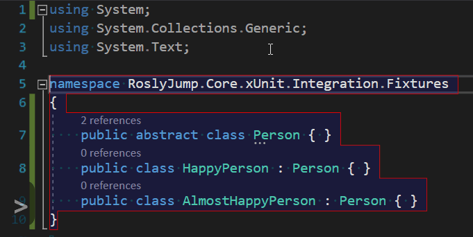

> This may be useful when you'd like:
>
> - Change a namespace
> - Go to a different class in the same file
> - Update a using statement

## Jump Between Constructors

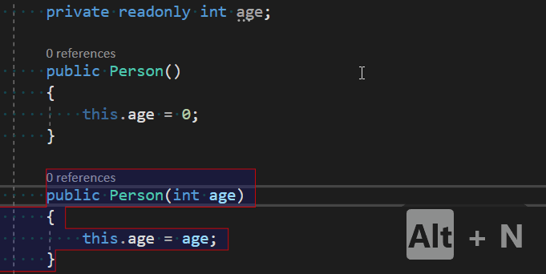

> This may be useful when you'd like:
>
> - Make changes in another constructor
> - Update another constructor after modifying an active one

## Jump Between Fields and Constructors

> Notice: the Person class does not have another members.
> There are no specific hotkeys yet to jump between fields and constructors.
> Actually, the caret jumps between class members.

## Jump Between Class Members

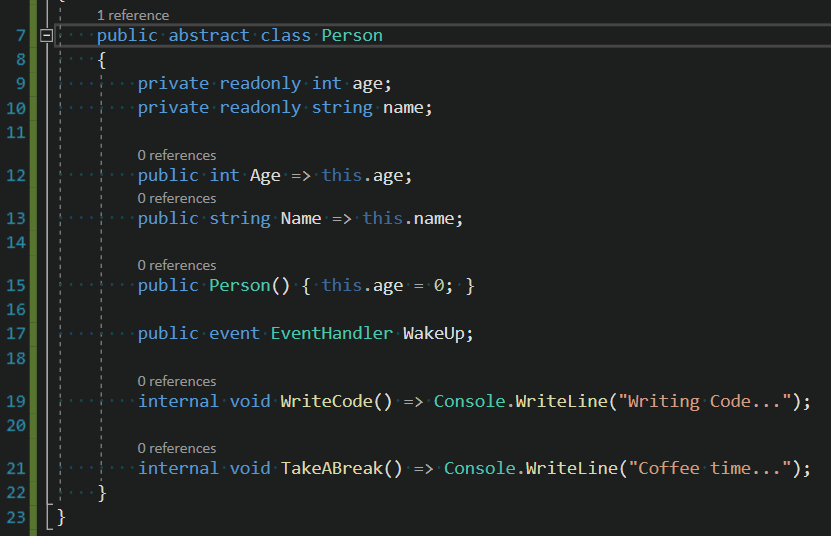

## Jump Between Properties

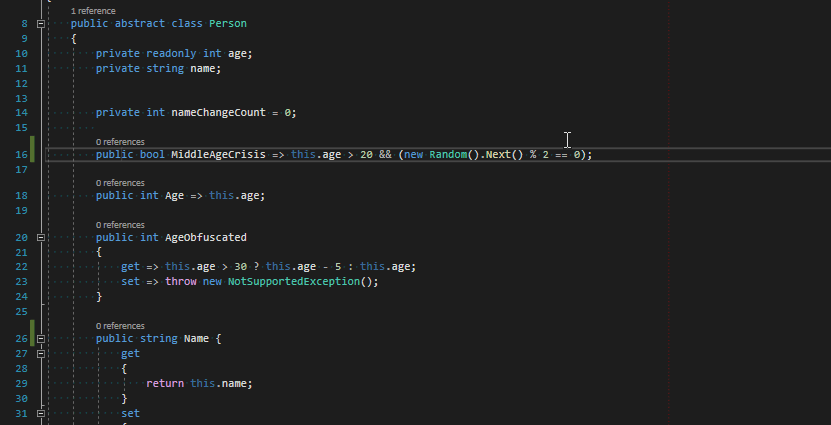

## Jump Between Full Property Members

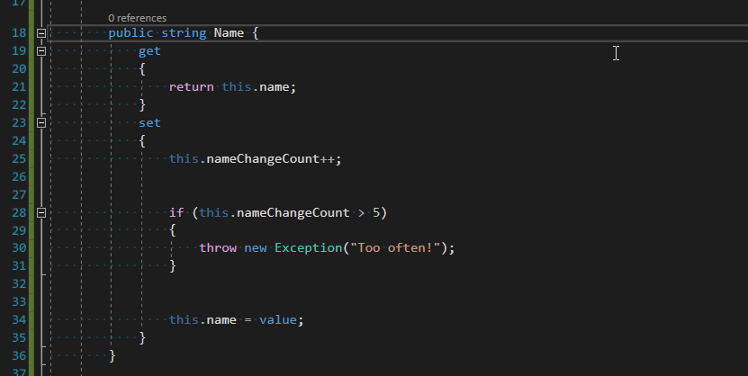

## Jump Between Read-Only Property Nested Expressions

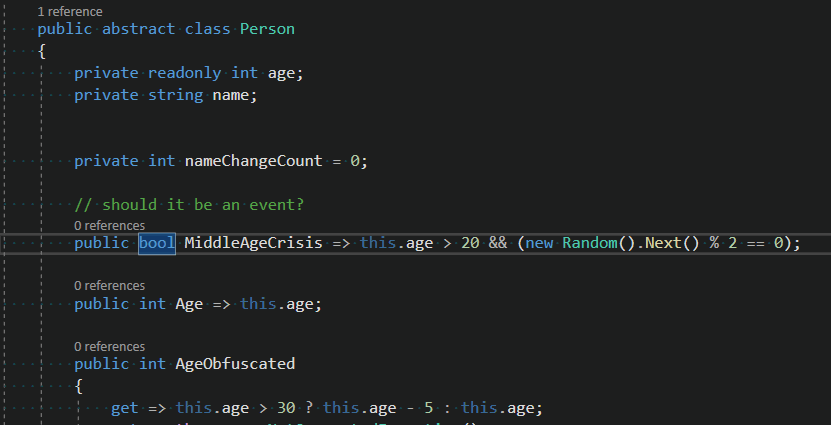

## Jump Between Expression-Bodied Getter and Setter Members

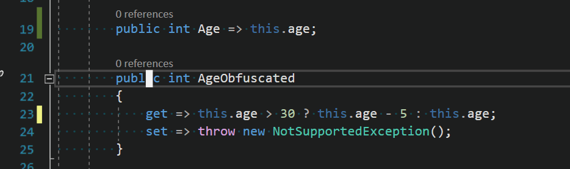

## Jump Between Method Parameters

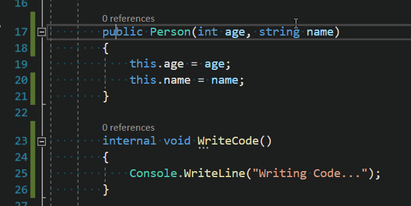

## Jump Between Method Declarations, Parameters, Body, Statements

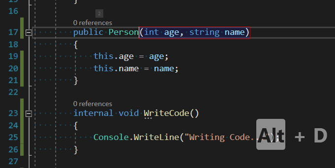

## Jump Between Methods

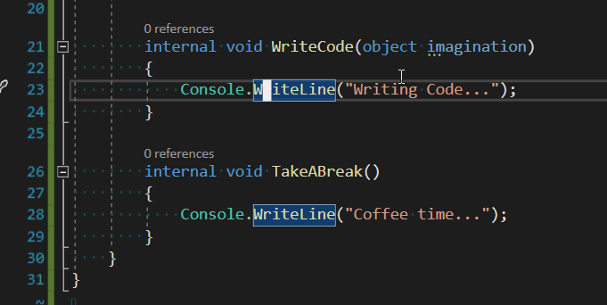

## Jump Between If-Statement Members

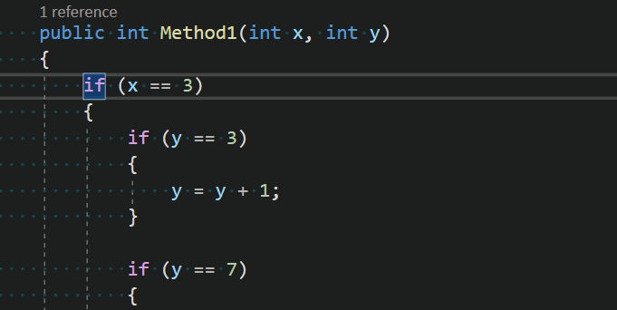

## Jump Between If-Else Clause

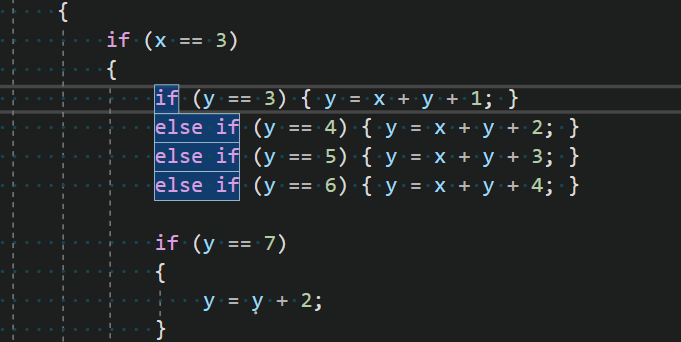
